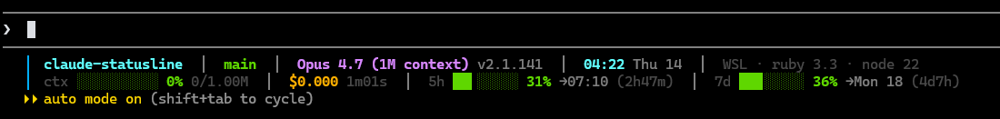

# Claude Code Status Line

A two-line, information-dense status line for [Claude Code](https://docs.claude.com/en/docs/claude-code) — workspace, git, model, time, environment, context, cost, and rate-limit windows, all at a glance.


---

## Preview



**Line 1** — workspace · VCS · model · time · environment
**Line 2** — context bar · session cost · 5-hour rate limit · 7-day rate limit

| Segment | Shows |
| --- | --- |
| `claude-statusline` | Project name (and `› subpath` when you're inside a sub-folder) |
| `main` | Git branch, plus dirty count `●N`, staged `+N`, unstaged `~N`, untracked `?N`, diff `+/-` lines, ahead `↑` / behind `↓`, stash `⚑N` |
| `xtpqrsvy @ feature (jj)` | Alternatively, [jujutsu](https://github.com/jj-vcs/jj) change id, bookmark(s), and dirty `●` flag |
| `Opus 4.7 (1M context) v2.1.141` | Model name, optional `1M` context tag, Claude Code version |
| `04:22 Thu 14` | Local time and weekday |
| `WSL · py 3.12 · ruby 3.3 · node 22` | Environment — WSL, Python (or active venv), Ruby, Node (cached 1h) |
| `ctx … 0% 0/1.00M` | Context window used, with sub-cell precision bar |
| `$0.000 1m01s … $3.2/h` | Total session cost, duration, `+/-` lines once you start editing, and `$/h` burn rate |
| `5h … 31% →07:10 (2h47m)` | 5-hour rate-limit window: used %, absolute reset, ETA |
| `7d … 36% →Mon 18 (4d7h)` | 7-day rate-limit window: used %, absolute reset, ETA |

Colors shift `green → yellow → orange → red` as bars approach 100%. The status line auto-compacts when the terminal is narrower than 100 columns.

---

## Install

The installer copies `statusline.sh` to `~/.claude/` and merges the `statusLine` block into `~/.claude/settings.json` (a timestamped backup is created first).

### From a clone

```bash
git clone https://github.com/brunombpereira/claude-statusline.git
cd claude-statusline
bash install.sh
```

### With GitHub CLI

```bash
gh repo clone brunombpereira/claude-statusline
cd claude-statusline
bash install.sh
```

Restart Claude Code (or open a new session) to see the status line.

---

## Requirements

- **bash** 3.2 or newer (the stock macOS system bash works — no Homebrew bash needed)
- **python3** (one short script parses Claude Code's JSON input)
- **git** (optional — only used to populate the git segment)
- **jj** (optional — used only if you set `STATUSLINE_VCS` to `jj` or `auto`; needs a `bookmarks`-era release, jj 0.21 or newer)

Designed for Linux, macOS, and WSL. The environment segment auto-detects WSL, Python (or an active venv), Ruby, and Node; it's cached for one hour to keep the status line snappy.

Check the installed version any time with:

```bash
bash ~/.claude/statusline.sh --version
```

---

## Configuration

### Environment variables

| Variable | Effect |
| --- | --- |
| `CLAUDE_STATUSLINE_COMPACT=1` | Force compact mode regardless of terminal width |
| `CLAUDE_STATUSLINE_DEBUG=1` | Log the raw Claude Code JSON to `~/.claude/statusline-debug.log` |
| `CLAUDE_CONFIG_DIR` | Override the install location (default `~/.claude`) |
| `COLUMNS` | If set and below `100`, compact mode kicks in automatically |
| `NO_COLOR` | Any non-empty value suppresses all ANSI color ([no-color.org](https://no-color.org)) |
| `STATUSLINE_VCS` | `auto` (default) · `git` · `jj` · `off` — pick or disable the VCS segment |
| `STATUSLINE_SHOW_ENV=0` | Hide the environment (WSL/python/ruby/node) segment |
| `STATUSLINE_SHOW_VERSION=0` | Hide the Claude Code version |
| `STATUSLINE_SHOW_BURN=0` | Hide the `$/h` burn-rate indicator |
| `STATUSLINE_SHOW_STASH=0` | Hide the git stash counter |
| `STATUSLINE_SHOW_DATE=0` | Hide the weekday/date next to the clock |
| `STATUSLINE_SHOW_OUTPUT_STYLE=0` | Hide the `★output_style` badge |

Set them in your shell rc, via Claude Code's environment configuration, or in the config file below.

### Config file

If `~/.claude/statusline.conf` exists it is **sourced as bash** on every refresh, before the palette is defined. Use it to set any of the variables above and to override palette colors without editing the script:

```bash
# ~/.claude/statusline.conf
STATUSLINE_SHOW_BURN=0
STATUSLINE_VCS=jj
GRN=$'\033[38;5;42m'    # swap the "green" used by progress bars
```

Because it is sourced, keep the file trusted — treat it like your shell rc.

### Refresh interval

The installer writes a `refreshInterval: 1` second. To slow it down, edit `~/.claude/settings.json` and bump the number — useful on slow machines or remote shells.

### Custom colors

The palette is defined near the top of `statusline.sh` in the `# ─── ANSI palette` block as standard 256-color escapes (`\033[38;5;N`). Override individual colors from the config file above rather than editing the script — the config is sourced before the palette is applied.

---

## How it works

Claude Code invokes the `statusLine.command` once per refresh interval and pipes a JSON payload describing the current session (workspace, model, context usage, cost, rate limits) on stdin. The script:

1. Parses the JSON in a single `python3` call.
2. Runs one `git status --porcelain=v2 --branch` for the workspace (or one `jj log` call for jujutsu repos).
3. Renders two lines with ANSI 256-color escapes, picking colors based on percentage thresholds.
4. Caches the environment segment (WSL/Python/Ruby/Node) to disk for one hour.

The whole thing finishes in well under 100 ms on a modern machine.

---

## Tests

Snapshot tests live in `tests/`. They pin every volatile input (time, timezone, env detection, VCS, color, width) so output is reproducible on any machine:

```bash
bash tests/run.sh            # run the snapshot tests
bash tests/run.sh --update   # regenerate expected output after a deliberate change
```

CI runs them on Ubuntu and macOS for every push and PR. See [CONTRIBUTING.md](CONTRIBUTING.md) for the full development workflow and configuration-variable reference.

---

## Manual install

1. Copy `statusline.sh` to `~/.claude/statusline.sh` and make it executable:
   ```bash
   mkdir -p ~/.claude
   cp statusline.sh ~/.claude/statusline.sh
   chmod +x ~/.claude/statusline.sh
   ```
2. Merge the block from `settings-snippet.json` into `~/.claude/settings.json`, replacing `YOUR_USER` with your actual username:
   ```json
   "statusLine": {
     "type": "command",
     "command": "bash /home/YOUR_USER/.claude/statusline.sh",
     "padding": 1,
     "refreshInterval": 1
   }
   ```
3. Restart Claude Code.

---

## Uninstall

```bash
bash uninstall.sh
```

This removes `~/.claude/statusline.sh` and strips the `statusLine` block from `~/.claude/settings.json`. Backups produced by `install.sh` are left in place so you can roll back manually if needed.

---

## Troubleshooting

**The status line doesn't appear after installing.** Restart Claude Code so it re-reads `settings.json`. Check `~/.claude/settings.json` for a `statusLine` block pointing at `bash <abs-path>/statusline.sh`.

**No git info shows.** The script silently skips git when the workspace isn't a git repo. If you expect git info, run `git -C <cwd> status` manually to confirm git can read the directory.

**Layout looks cramped or wrapped.** Either your terminal is narrower than 100 columns (compact mode auto-engages) or your terminal's reported `COLUMNS` is wrong. Force full mode by unsetting `CLAUDE_STATUSLINE_COMPACT`; force compact mode by setting `CLAUDE_STATUSLINE_COMPACT=1`.

**Something is parsing wrong.** Set `CLAUDE_STATUSLINE_DEBUG=1` and tail `~/.claude/statusline-debug.log` — you'll see the raw JSON Claude Code is sending and the parsed fields.

**Environment segment is stale.** Delete `~/.claude/.statusline-env-cache` to force a refresh.

---

## Contributing

Issues and pull requests are welcome. If you have a tweak — different palette, extra segment, alternative compact layout — open a PR. Keep changes focused and try not to balloon the script with rarely-used features. See [CONTRIBUTING.md](CONTRIBUTING.md) for the test workflow and the full list of configuration variables, and [CHANGELOG.md](CHANGELOG.md) for release history.

---

## License

[MIT](LICENSE) © Bruno Pereira
